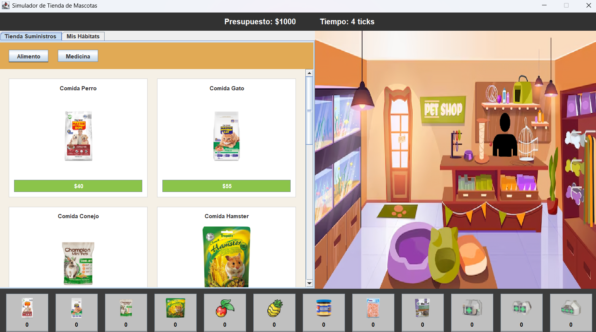
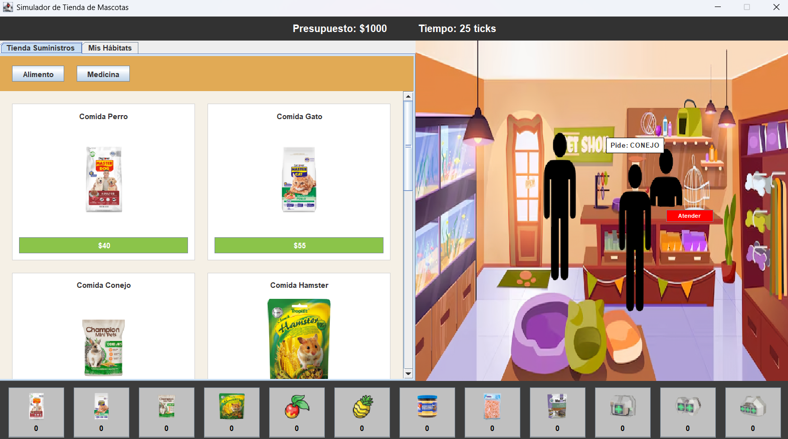

# Simulador de Tienda de Mascotas 

## Información del Equipo
* **Número de Grupo:** Grupo 18
* **Integrantes:** 
- Alonso Ignacio Vergara Olivari
- Cristobal Benjamin Chavez Sandoval
- Francisca Belen Hidalgo Pezo

---

## Enunciado
El proyecto consiste en el diseño e implementación de un **Simulador de Gestión de Tienda de Mascotas** utilizando Java y el paradigma de Programación Orientada a Objetos. El jugador asume el rol del administrador de la tienda, debiendo gestionar un presupuesto inicial para comprar hábitats (Casa, Acuario, PokéCasa), adquirir distintas especies de mascotas, mantener sus estadísticas vitales (Salud, Alimentación, Higiene y Felicidad) mediante la compra y uso de suministros, y finalmente vender dichas mascotas a los clientes generados dinámicamente en una fila de espera para obtener ganancias.

---

## Diagramas y Vistas

### Diagrama de Casos de Uso

### Captura de Pantalla de la Interfaz

*(El juego utiliza Java Swing con una perspectiva en primera persona desde el mostrador del vendedor).*

### Diagrama de Clases UML

*(El diagrama detalla las jerarquías de herencia de Mascotas y Suministros, junto con la implementación de las interfaces de los patrones de diseño).*

---

## Patrones de Diseño Implementados

El proyecto hace un uso extensivo de patrones de diseño de software para garantizar la escalabilidad, el bajo acoplamiento y la alta cohesión del código.

### 1. Singleton
* **Justificación:** Se requiere que exista un único inventario global, una única fila de clientes y un solo registro financiero de la tienda en toda la ejecución del programa. Si existieran múltiples instancias, el inventario se desincronizaría.
* **Clases involucradas:** `Tienda`.

### 2. Factory Method
* **Justificación:** Centraliza y encapsula la lógica de creación de las distintas especies de mascotas. Evita que la lógica del negocio o la interfaz gráfica tengan que conocer los detalles de instanciación de cada clase específica (Perro, Gato, Pulpo, etc.), facilitando la incorporación de nuevos animales en el futuro.
* **Clases involucradas:** `MascotaFactory`, `Mascotas` (y todas sus subclases), `TipoMascota` (Enum).

### 3. Observer
* **Justificación:** El juego requiere que el tiempo pase ("ticks") y que múltiples entidades reaccionen a él (las mascotas se desgastan, el generador evalúa si llega un cliente). En lugar de usar múltiples hilos (Threads) que saturen la memoria, un solo reloj notifica asíncronamente a todos los objetos suscritos.
* **Clases involucradas:** `Reloj` (Sujeto), `ObservadorReloj` (Interfaz Suscriptor), `Mascotas`, `GeneradorCliente`.

### 4. State
* **Justificación:** El comportamiento de una mascota cambia drásticamente dependiendo de sus atributos (por ejemplo, una mascota enferma no puede jugar, una hambrienta se desgasta más rápido). El patrón State evita cadenas gigantes de `if/else` en la clase base, delegando el comportamiento a clases de estado específicas.
* **Clases involucradas:** `EstadoMascota` (Interfaz), `EstadoSano`, `EstadoHambriento`, `EstadoEnfermo`.

---

##  Decisiones Importantes y Mejoras a la Temática

A lo largo del desarrollo, el equipo tomó decisiones clave que desviaron o mejoraron la temática tradicional de un simulador:
1. **Interfaz tipo Dashboard y Perspectiva de Diorama (UI/UX):** Tras iterar sobre el diseño visual, se decidió abandonar la idea de una vista en primera persona (desde los ojos del cajero) para adoptar una perspectiva de tercera persona del interior de la tienda en el `PanelClientes`. Esta decisión arquitectónica permitió dividir la pantalla en un *dashboard* funcional: la gestión dura (catálogos de compra y pestañas) a la izquierda, el inventario rápido en la parte inferior, y la simulación visual (la fila de clientes interactuando con el mostrador) a la derecha. Esto mantiene la pantalla limpia, evita la superposición de menús y facilita al jugador procesar la información rápidamente.
2. **Expansión del Universo de Mascotas:** Se decidió no limitar la tienda a animales domésticos tradicionales. Se crearon hábitats personalizados (`Acuatico`, `Pokecasa`) para incluir criaturas exóticas y de ficción (Pulpos, Eevee, Bulbasaur), dándole un valor agregado y divertido al juego.
3. **Limitación de Fila (Game Design):** Se limitó la fila a un máximo de 3 clientes simultáneos. Si la tienda está llena, los nuevos clientes se van. Esto añade una capa de presión y estrategia al jugador, obligándolo a gestionar su tiempo rápidamente.
4. **Motor de Tiempo Desacoplado:** El reloj de simulación (`ScheduledExecutorService`) corre estrictamente en la lógica del negocio, mientras que la interfaz gráfica (`Timer` de Swing) solo lee los datos. Esta decisión arquitectónica evita el congelamiento de la pantalla (Freezing) y cumple con el patrón Modelo-Vista-Controlador.
5. **Bloqueo de Resolución y Prevención de Deformación (UI/UX):** Se tomó la decisión estricta de bloquear la redimensión de la ventana principal (`setResizable(false)`). Al construir interfaces personalizadas como la fila de clientes (`PanelClientes`), el juego calcula matemáticamente las distancias (coordenadas absolutas) de los sprites. Si se permitiera al usuario maximizar o estirar la ventana, el motor de Java Swing desajustaría estos elementos, rompiendo la inmersión con espacios vacíos o deformaciones gráficas. Esta restricción garantiza que la experiencia visual sea idéntica y estable en cualquier monitor.

---

## ⚠️ Problemas Identificados y Autocrítica

Durante el ciclo de desarrollo enfrentamos varios retos técnicos y de gestión:

* **Desincronización Vista-Modelo ("Mascotas Fantasma"):** * *El problema:* Inicialmente, al vender una mascota, el backend la eliminaba, pero la interfaz la seguía dibujando en el hábitat.
  * *Autocrítica:* Asumimos erróneamente que la interfaz se actualizaría sola al borrar el objeto en memoria. Aprendimos la importancia de forzar eventos de repintado (`repaint()`) explícitos tras las transacciones y mejorar la comunicación bidireccional de los paneles.
* **Gestión de Pruebas Unitarias (TDD):**
  * *El problema:* Retrasar la creación de los tests de JUnit causó que errores matemáticos básicos (como tasas de desgaste incorrectas de los animales) pasaran desapercibidos hasta etapas avanzadas.
  * *Autocrítica:* La gestión del tiempo del equipo falló en este aspecto. Implementar las pruebas al final nos obligó a adaptar el código a los tests en lugar de usarlos como guía arquitectónica desde el principio. 
* **Concurrencia entre el Motor Lógico y la Interfaz Gráfica (Multithreading):**
  * *El problema:* El `Reloj` del juego se ejecuta en un hilo secundario asíncrono (`ScheduledExecutorService`), mientras que la interfaz lee los datos a través del hilo de eventos de Swing (EDT). Si la lógica elimina una mascota exactamente en el mismo milisegundo en que la interfaz la está leyendo para dibujarla, se corre el riesgo de un error fatal (`ConcurrentModificationException`).
  * *Autocrítica:* Aunque en `Reloj` implementamos un `CopyOnWriteArrayList` de forma correcta para los observadores, nos faltó aplicar colecciones concurrentes o sincronización (`synchronized`) en la lista principal de `Mascotas` en la `Tienda` para blindar el juego por completo contra problemas de hilos.
* **Escalabilidad de la Interfaz (Uso de Layout Nulo):**
  * *El problema:* En la clase `PanelClientes`, para lograr el efecto visual 2D y colocar los clientes exactamente frente al mostrador, tuvimos que desactivar los gestores de diseño de Java (`setLayout(null);`) y usar coordenadas absolutas en píxeles.
  * *Autocrítica:* Aunque esto nos dio un control visual perfecto, hace que el componente sea rígido. Por eso nos vimos obligados a bloquear el tamaño de la `VentanaPrincipal` (`setResizable(false)`). En el futuro, deberíamos investigar sobre motores gráficos 2D especializados o layouts dinámicos avanzados para que el juego pueda jugarse en pantalla completa adaptándose a cualquier monitor.

---

## Compilación y Ejecución 

Para compilar y ejecutar el proyecto (si se hace desde terminal o un IDE genérico):
1. Asegúrese de estar en el directorio raíz del proyecto (`src`).
2. Compile las clases: `javac logica/*.java GUI/*.java main/*.java`
3. Ejecute la clase principal: `java main.Main`